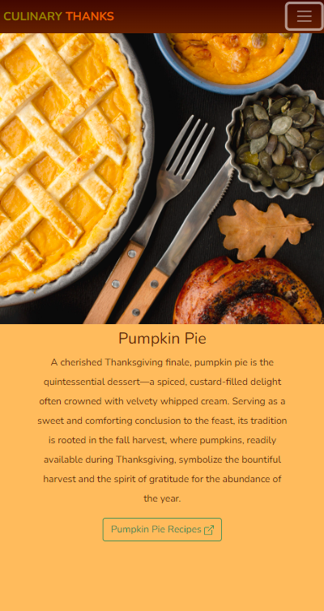

# Culinary Thanks: Classic Thanksgiving Dishes
> A turkey’s worst day

 

This project uses HTML, CSS, and Bootstrap to create a responsive and visually appealing One page layout website. Inspired by Colt Steele's Museum of Candy project from the WDBC course.

## Table of Contents

- [Overview](#overview)
- [Getting Started](#getting-started)
- [Technologies Used](#technologies-used)
- [Project Structure](#project-structure)
- [Contributing](#contributing)
- [License](#license)

## Overview

**Culinary Thanks: Classic Thanksgiving Dishes** showcases the technical implementation of a one-page website dedicated to the traditional dishes of Thanksgiving. From the centerpiece roast turkey to the comforting mashed potatoes, savory stuffing, and the quintessential pumpkin pie, explore the culinary delights that make Thanksgiving special. Happy coding and happy Thanksgiving! 🍽

### [Deployed Page ➡️ >>](https://cyphernyx.github.io/culinary-thanks/)

### Screenshots
- Landing Page:

- Mobile, Nav collapsed

- Mobile, Expanded Nav

-Full Screencapture - desktop version

## Getting Started
To view the project, simply open the `index.html` file in your web browser. If you want to contribute or explore the codebase, follow the steps below:

1. Clone the repository: `git clone https://github.com/CypherNyx/culinary-thanks.git`
2. Open the project in your preferred code editor.
3. Explore the HTML, CSS, and Bootstrap code in the `root` directory.
4. Make changes or improvements as needed.

## Technologies Used

- HTML5
- CSS3
- Bootstrap

## Project Structure

- `index.html`: Main HTML file for the one-page website.
- `style.css`: Primary CSS file housing the project's stylesheet.
- `assets/`: Directory for storing project images.
- `LICENSE`: The project's license file.
- `README.md`: Project documentation.

## Attributions

- Stuffing Image by <a href="https://www.freepik.com/free-photo/top-view-hands-holding-pan-with-stuffing_9894224.htm#query=stuffing&position=6&from_view=search&track=sph">Freepik</a>
- Turkey Image by <a href="https://www.freepik.com/free-photo/close-up-turkey-prepared-thanksgiving-day_9546190.htm#query=thanksgiving%20turkey&position=10&from_view=search&track=ais">Freepik</a>
- Pumpkin pie Image by <a href="https://www.freepik.com/free-photo/flat-lay-pumpkin-pie-thanksgiving_10302716.htm#query=pumpkin%20pie&position=1&from_view=search&track=ais">Freepik</a>
- Mashed Potatoes Image by <a href="https://www.freepik.com/free-photo/top-view-delicious-mashed-potatoes_7534635.htm#query=thanksgiving%20mashed%20potato&position=1&from_view=search&track=ais">Freepik</a>
- Thanksgiving Icon Pack by <a href="https://www.freepik.com/free-vector/round-background-with-thanksgiving-items_960532.htm#query=thanksgiving%20icons&position=10&from_view=search&track=ais">Freepik</a>

 

## Contributing
Pull requests are welcome. Please open an issue first to discuss any proposed changes or additions.
 

## License

  
  https://opensource.org/licenses/MIT   
  This project is open source and available under the MIT License.

 

  ## Questions
  GitHub [CypherNyx](https://github.com/CypherNyx) 
  Email: dguido.dev@gmail.com
